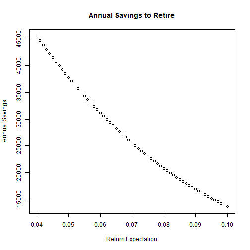

Retirement Analysis
========================================================
author: Brent Crossman
date: 6/3/15

https://bcrossman.shinyapps.io/Retirement

Do you want to retire?
========================================================

You can't get somewhere without knowing where you're going.My retirement app 
helps you know where you're going. 

The output is individualized based on:

- Age and Demographics
- Return and Inflation Expectations
- Savings and ability to save

Future $: Not As Good As Today's $
========================================================

The first issue is it costs a lot more to maintain your lifestyle in the future
than what you're paying for that lifestyle today. You have to account for inflation. 
For instance, a family currently spending $5K a month for housing, cars, clothing, 
internet/tv/phone, and etc, equates to the following annual need in 35 years when
you retire (given 3.5% inflation):


```
[1] 200.0154
```

And it doesn't stop growing then. The need keeps growing even when you're in retirement

So what do I need?
========================================================
Assuming that $200K of annual expense need, if you intend to live roughly 25 
years after retirement and can invest your savings at5% after you retire the 
amount you'll need to retire is 


```
[1] "4,431,199"
```
<small> This takes into account$24K of annual post-tax Social Security receipt 
and a 20% tax rate on distributions</small>

How do I get there?
========================================================
That might seem like a big number but the following chart shows how much you'll need to save per year to hit that retirement hurdle in 35 years under various return expectations:


<small><small>Remember, this number needs to increased by 2% a year to hit your final retirement hurdle.</small></small>
